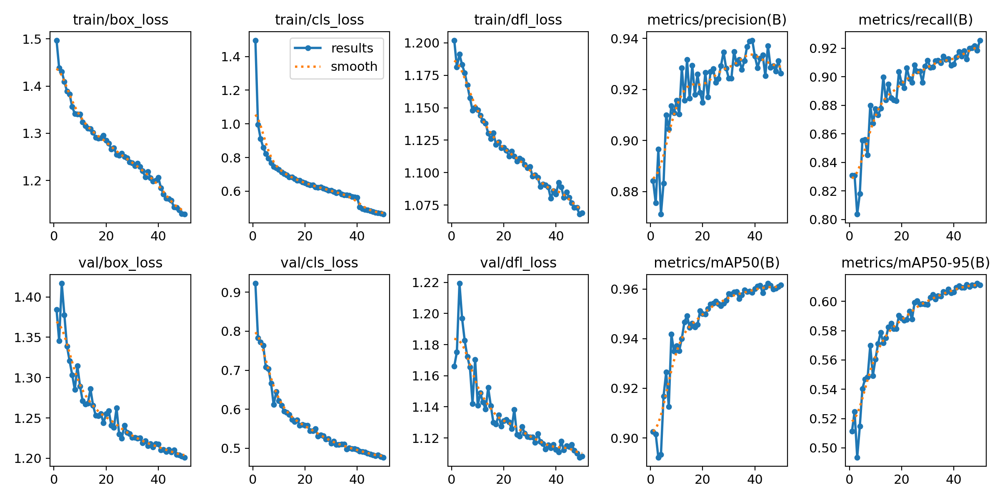
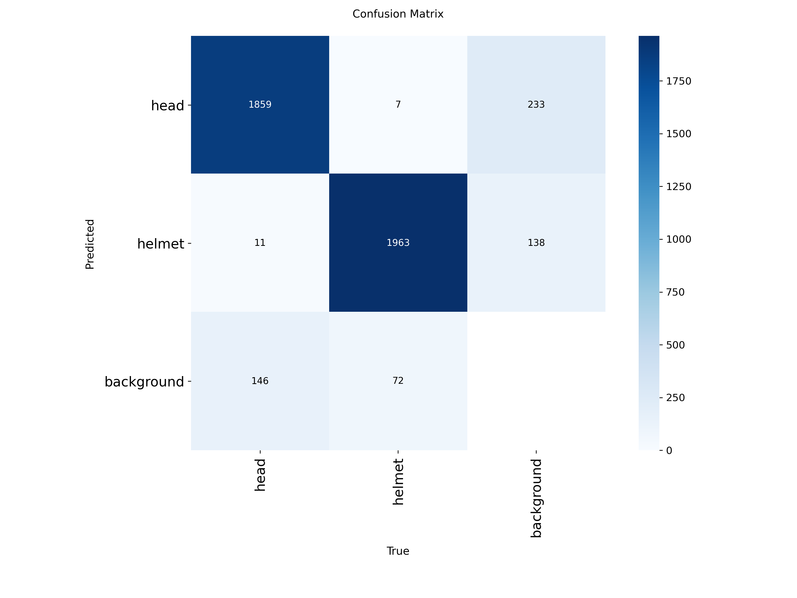
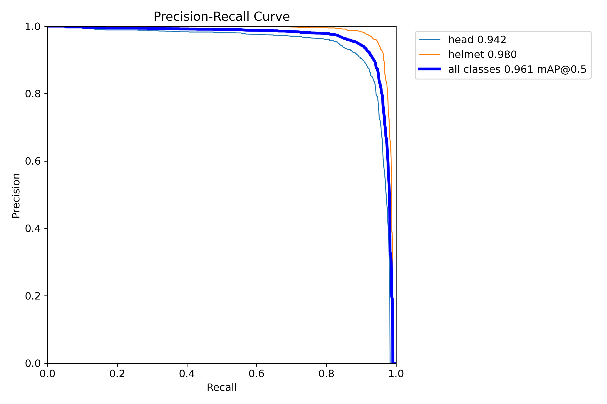
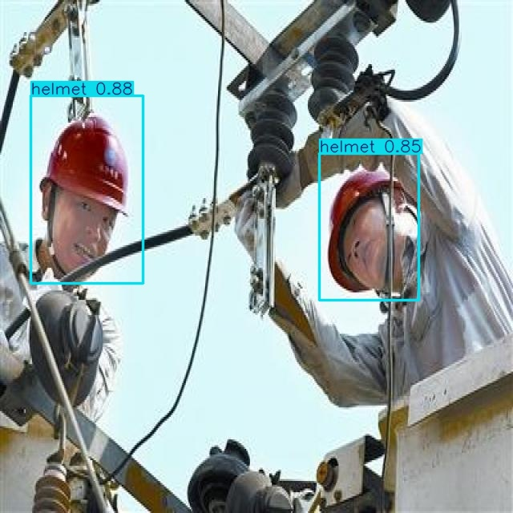
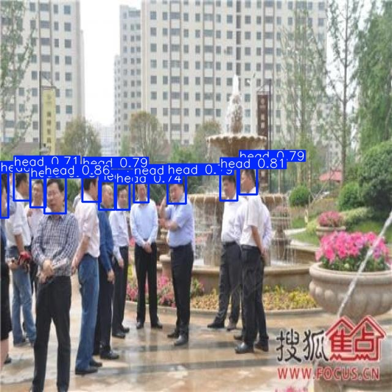
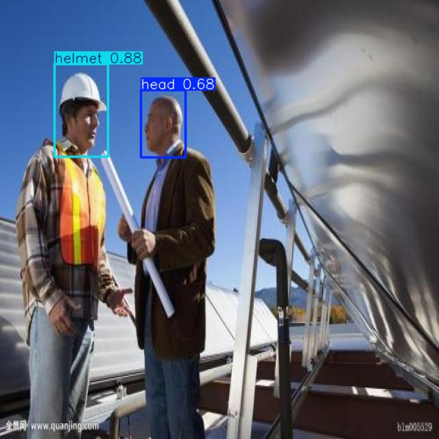

# YOLO Object Detection

This project demonstrates object detection using the **Ultralytics YOLO** framework. It includes dataset preparation, model training, evaluation, and inference on custom images.

## Features

* Custom dataset training
* Model evaluation
* Object detection on images
* Performance visualization
* Inference using trained YOLO model

## Technologies

* Python
* PyTorch
* Ultralytics YOLO
* OpenCV
* NumPy
* Matplotlib

## Project Structure

```text
yolo-object-detection/
│
├── dataset/
│   ├── README.dataset.txt
│   └── README.roboflow.txt
│
├── configs/
├── results/
├── models/
├── runs/
├── src/
    ├── predict.py
    ├── utils.py
    └── train.py
├── main.py
├── requirements.txt
└── README.md
```

## Dataset

The model was trained on a dataset downloaded from **Roboflow Universe**.

Due to its size, the dataset is **not included** in this repository.

Dataset information and export details are available in:

* `dataset/README.dataset.txt`
* `dataset/README.roboflow.txt`

After downloading the dataset, place it inside the `dataset/` directory before training.

## Training

Install the dependencies:

```bash
pip install -r requirements.txt
```

Start training:

```bash
python main.py --train
```

## Inference

Run object detection:

```bash
python main.py --predict
```

## Training Results

### Training Metrics

<p align="center">
  
</p>

The training curves show the evolution of losses and evaluation metrics throughout the training process.

### Confusion Matrix

<p align="center">
  
</p>

The confusion matrix illustrates the classification performance for each object class.

### Box Precision–Recall Curve

<p align="center">
  
</p>

### Detection Examples

<p align="center">
  
  
  
</p>

Additional examples are available in the `results/` directory.

## Future Improvements

* Hyperparameter optimization
* Data augmentation experiments
* Real-time video inference
